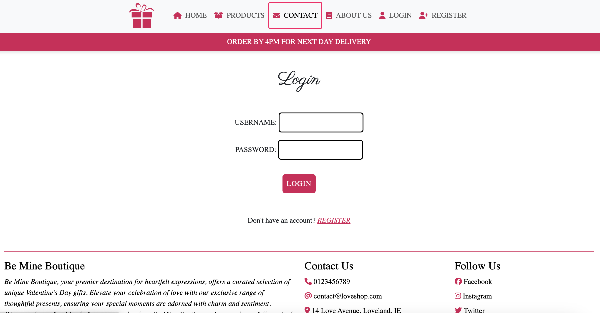
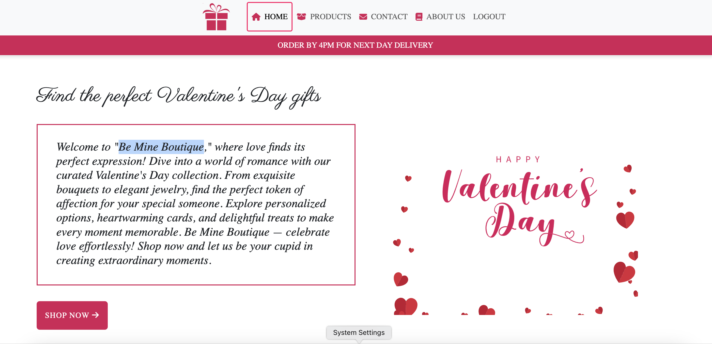

# Be Mine Boutique

### [Live link to Be Mine Boutique](https://loveshop-037a9f640521.herokuapp.com/)
# Intro:

### Be Mine Boutique - Your Ultimate Destination for Romantic Delights

Welcome to Be Mine Boutique, the enchanting online emporium designed to make every moment of love unforgettable. As we pave the way to celebrate the essence of romance, Be Mine Boutique is your go-to destination for exquisite Valentine's gifts that speak volumes of affection.

- About Be Mine Boutique
At Be Mine Boutique, we believe in turning ordinary moments into extraordinary memories. Our e-commerce platform is meticulously crafted to curate an extensive collection of romantic gifts, ensuring you find the perfect expression of love for your special someone. From timeless classics to unique, personalized treasures, Be Mine Boutique offers an array of options that cater to every taste and style.

- Why Be Mine Boutique?
Curated Selection: Our team of experts handpicks each item to ensure a diverse and thoughtful selection of gifts. From classic roses to innovative and personalized keepsakes, Be Mine Boutique has it all.

Ease of Navigation: We understand the importance of a seamless shopping experience. Our user-friendly interface allows you to effortlessly browse through products, making your journey to find the ideal gift enjoyable and stress-free.

Secure Transactions: Your security is our priority. Be Mine Boutique employs state-of-the-art encryption and secure payment gateways to ensure that your transactions are protected at every step.

Spread the Love
Join us in the journey of spreading love and joy. Be Mine Boutique is not just a place to buy gifts; it's an experience crafted to enhance your celebrations and create lasting memories. Celebrate love, express emotions, and make every moment count with Be Mine Boutique.

Happy shopping!

# Table of Contents
- [Be Mine Boutique](#be-mine-boutique)
- [Intro](#intro)
- [Table of Contents](#table-of-contents)
- [Judging Criteria](#judging-criteria)
- [Project](#project)
 - [Objective](#objective)
 - [Site User Goal](#site-user-goal)
 - [Project Management](#project-management)
   - [Github Project Board](#github-project-board)
 - [User stories](#user-stories)
   - [Strategy](#strategy)
   - [Scope](#scope)
   - [Skeleton](#skeleton)
   - [UX](#ux)
   - [Planning](#planning)
   - [Surface](#surface)
 - [Technologies used](#technologies-used)
   - [Main languages](#main-languages)
   - [Frameworks and Libraries](#frameworks-and-libraries)
   - [Others](#others)
 - [Features](#features)
   - [Existing Features](#existing-features)
     - [Navigation Bar](#navigation-bar)
     - [Sign in and Login](#sign-in-and-login)
     - [Home Page](#home-page)
     - [Product Page](#product-page)
     - [Contact Us Page](#contact-us-page)
     - [About Us Page](#about-us-page)
     - [Checkout](#checkout)
     - [Footer](#footer)
   - [Features Left to Implement](#features-left-to-implement)
 - [Testing](#testing)
 - [Deployment](#deployment)
   - [Version Control](#version-control)
   - [Heroku Deployment](#heroku-deployment)
   - [Local Deployment](#local-deployment)
   - [Cloning](#cloning)
 - [Credits](#credits)
 - [Acknowledgements](#acknowledgements)

# Judging Criteria
### 1. User Experience & Accessibility

- Our project prioritizes a seamless and inclusive experience for all users. The user interface is designed with accessibility in mind, ensuring that everyone, regardless of ability, can navigate and interact with ease.

### 2. Project is Responsive
- Our project is built with responsiveness in mind. Whether you're accessing it from a desktop, tablet, or mobile device, the layout and design adapt gracefully to different screen sizes, providing a consistent and visually appealing experience.

### 3. Project Aligns Well to Hackathon Theme
- Every aspect of our project is crafted with the Hackathon theme in mind. From the design elements to the functionality, our project aligns seamlessly with the theme, showcasing our commitment to the event's purpose.

### 4. Project was Well-Planned and Executed (using GitHub Projects)
- We, a collaborative team, meticulously planned and executed our project using GitHub Projects. Our project board served as a central hub for task management, issue tracking, and collaboration, ensuring a well-organized and efficiently executed development process.

### 5. Project Uses One of the CSS Frameworks
- To enhance the project's styling and maintain consistency, we, as a team, chose [Bootstrap](https://getbootstrap.com/) as our CSS framework. This choice not only streamlined our design process but also contributed to the overall responsiveness and visual appeal of the project.

### Teamwork and Collaboration
Our success is a testament to the power of teamwork. The collaborative efforts of each team member played a crucial role in achieving our goals. Regular communication, shared responsibilities, and a shared vision were the driving forces behind the seamless execution of this project. We believe that effective teamwork is the foundation of innovation, and our project reflects the dedication and synergy of our talented team.

[Back to Top](#table-of-contents)
 

# Project

## Objective

The primary objective of Be Mine Boutique is to create an immersive and user-friendly e-commerce platform dedicated to offering a diverse range of romantic gifts for the celebration of love, with a particular focus on Valentine's Day. Our goal is to provide users with a curated selection of timeless classics, innovative personalized items, and expressive tokens of affection.

## Site User Goal

The primary goal for users visiting Be Mine Boutique is to discover and acquire the perfect romantic gift to express their love and create memorable moments, particularly for occasions like Valentine's Day. Users aim to explore a thoughtfully curated collection of timeless classics and personalized treasures, effortlessly navigating the site to find unique and meaningful items that resonate with their emotions. Be Mine Boutique empowers users to enhance their celebrations by providing a seamless and secure online shopping experience, where they can easily select and purchase the ideal gift to convey their sentiments and make every romantic occasion truly special.

## Project Management

### Github Project Board

The Project Board facilitated a comprehensive overview of the project, breaking down tasks, features, and milestones into manageable cards. This approach allowed us to maintain a structured and organized workflow, ensuring that each component of Be Mine Boutique was systematically addressed.

[Back to Top](#table-of-contents)
 

# User stories

The integration of user stories derived from our wireframe designs on the Project Board has been instrumental. It provided a clear linkage between design concepts and functional requirements, ensuring that the development team was aligned with the envisioned user experience. This connection between design and implementation has been crucial in delivering a product that not only meets technical specifications but also aligns seamlessly with the intended user journey.

|  | | |
|:-------:|:--------|:--------|
| User Story 1 (Must Have)| As a First Time User | I want to be able to immediately access the Valentine's day themed products upon landing on the website, without the need to navigate through other pages.
So that I can quickly and conveniently explore and purchase gifts for my loved ones. | &check; |
| User Story 2 (Must Have)| As a potential customer | I want to read detailed product descriptions, accompanied by high-quality images and customer reviews,
So that I can make informed decisions regarding my purchase. | &check; |
| User Story 3 (Must Have)| As a First Time User | I would like to have a seamless check-out process allowing for various payment options, ensuring convenience and security when making my first order on the website.
So that I can have a smooth and secure experience during the checkout process. | &check; |
| User Story 4 (Must Have)| As a First Time Use | I would like to have an easy method to create an account, sign in to the shop, and sign up for the website's newsletter.
So that I can keep up to date with new products and promotions. | &check; |
| User Story 5 (Must Have)| As a First-Time User | I want to neasily access the contact page, about page, FAQ’s page, and privacy policy on the platform to facilitate queries and communication.
So that I can find relevant information and communicate effectively with the platform. | &check; |
| User Story 6 (Must Have)| As a First time User | I want to be notified about any changes I have made
So that I have a clear understanding of what has been completed/updated. | &check; |
| User Story 7 (Should Have)| As a Returning User with a Loyalty Card | I expect to receive personalized recommendations based on my past purchases
So that it is easier for me to discover relevant Valentine’s day gift ideas. | &check; |
| User Story 8 (Should Have)| As a Returning User with a Loyalty Card | I appreciate exclusive discounts or promotions offered to loyal customers
So that it provides incentive for me to continue shopping. | &check; |
| User Story 9 (Must Have)| As a Returning User | I look forward to a seamless shopping experience
So that it is convenient and efficient.| &check; |
| User Story 10 (Must Have)| As a Returning User | I anticipate streamlined account management features
So that it is easy and efficient to manage my account. | &check; |
| User Story 11 (Must Have)| As a Returning User | I want to receive a newsletter sent to my email.
So that I can stay updated on upcoming sales, new product launches, and gift ideas tailored to my preferences. | &check; |
| User Story 12 (Must Have)| As a Returning User | I want to find responsive customer service demonstrating the brand’s commitment to customer satisfaction and building trust for future shopping experiences.
So that I can resolve any issues or concerns promptly and feel confident in my future interactions with the brand. | &check; |
| User Story 13 (Must Have)| As a Registered User | I want to have transparency and peace of mind regarding delivery timelines and product quality.
So that I can track my orders and ensure they are delivered on time and meet my expectations. | &check; |
| User Story 14 (Must Have)| As a Registered User | I want to have the possibility to add selected products to my wishlist so that I can save them for later purchase. | &check; |
| User Story 15 (Must Have)| As a Registered User | I want to have the possibility to access my profile so I can see all my personal details. | &check; |
| User Story 16 (Must Have)| As a Registered User | I want to leave a review for a product I have purchased so I can share my feedback with other users. | &check; |
| User Story 17 (Must Have)| As a Registered User | I want to be able to easily write and attach personalized messages to my gift orders so I can add a special touch for my loved one. | &check; |
| User Story 18 (Must Have)| As a Store Owner |  want to easily add, edit, and delete products from the shop so that I can make sure the website is up to date. | &check; |
| User Story 19 (Must Have)| As a Store Owner | I want to be connected with the website customers,
So that I can effectively communicate with them and keep them updated. | &check; |
| User Story 20 (Must Have)| As a Store Owner | I want to be able to view and manage customer reviews for products on the website,
So that I can maintain the quality of product reviews and ensure customer satisfaction. | &check; |

[Back to Top](#table-of-contents)
 

## Strategy

### Development Approach

Our development strategy for Be Mine Boutique centered around delivering a seamless and enchanting shopping experience for users. Key aspects of our approach include:

1. **User-Centric Design:**
  - Prioritizing user experience and engagement through intuitive interfaces and user-friendly features.

2. **Agile Development:**
  - Embracing an agile development methodology to adapt quickly to changing requirements and deliver incremental updates.

3. **Cross-Functional Collaboration:**
  - Fostering collaboration between design, development, and testing teams to ensure a cohesive and polished end product.

## Scope

### Overview

Be Mine Boutique is an e-commerce platform specifically designed to cater to the unique gifting needs of Valentine's Day. The scope of this project revolves around providing users with a delightful and convenient shopping experience centered on love and celebration.

### Key Features

### 1. Curated Valentine's Day Collection

Be Mine Boutique features a carefully curated collection of Valentine's Day gifts, including chocolates, flowers, jewelry, and more.

### 2. User Registration and Authentication

To enhance user engagement, the platform allows users to register for accounts securely. The authentication process ensures a personalized shopping experience.

### 3. Intuitive Product Pages

The product pages are designed for ease of navigation, presenting users with detailed information about each item, including pricing and availability.

### 4. Seamless Shopping Cart

Users can easily add and remove items from their shopping carts, providing a hassle-free experience while managing their selections.

### 5. Secure Checkout Process

A secure and intuitive checkout process ensures that users can efficiently provide their full address and payment details to complete their purchases.

### 6. Responsive Design

Be Mine Boutique is developed with a responsive design, ensuring a consistent and optimal user experience across various devices and screen sizes.

## Future Enhancements

While the current scope focuses on the core features for Valentine's Day, our roadmap includes potential enhancements such as:

- **Expanded Product Categories:**
 - Diversifying the product range to cater to other occasions and celebrations.

- **User Reviews and Ratings:**
 - Implementing a feedback system to allow users to share their experiences and recommendations.

- **Personalized Recommendations:**
 - Introducing personalized recommendation features based on user preferences and purchase history.

Our commitment is to continuously evolve and expand the scope based on user feedback and emerging trends in the e-commerce landscape.

**Website Sections:**

### Skeleton
The website is designed to be clear and simple. The site has a main login page which wen completed opens to a dashboard page. On this dashboard there are multiple tabs which the user can use to navigate the various tools availiable to them.
-  Wireframes
In the initial design phase of Be Mine Boutique, we utilized Figma to create a comprehensive wireframe, providing a visual blueprint for the e-commerce platform. Figma's collaborative features facilitated real-time teamwork, ensuring a cohesive visualization of the user interface. The wireframe outlines essential elements, including navigation menus and product displays, guiding a seamless and intuitive user experience.

[Wireframe](https://www.figma.com/file/wKzMN7lJ3J6kuoPx5ZbyCn/Wireframe?type=design&node-id=0-1&mode=design&t=vupIF9MRZJLTBluZ-0)

## UX

#### Intuitive Navigation

- The website features a straightforward and intuitive navigation system, ensuring users can easily find what they're looking for.

#### Responsive Design

- The design adapts seamlessly across different devices and screen sizes, offering an optimal viewing experience whether on desktop, tablet, or mobile.

#### Engaging Visuals
- Be Mine Boutique prioritizes Engaging Visuals to create a visually delightful and seamless user experience. From wireframe concepts to product displays, we focus on captivating aesthetics to enhance the charm of our Valentine's Day gifts. Explore a visually appealing online shopping journey that combines the spirit of romance with user-friendly design.

#### Accessibility
- At Be Mine Boutique, accessibility is a priority. We're committed to creating an inclusive online space with features like clear text, structured layouts, and image alt text. Our goal is to ensure a seamless and enjoyable shopping experience for everyone.

#### User-Friendly Features
- At Be Mine Boutique, user-friendly features are at the forefront of our design. Navigating through our website is intuitive, with clear menus, straightforward product displays, and a streamlined checkout process. We've prioritized a seamless user experience, ensuring that every click is a step closer to finding the perfect Valentine's Day gift.

### Planning

Planning is the backbone of Be Mine Boutique's success. From conceptualizing the initial wireframes to orchestrating a seamless user experience, meticulous planning has been the driving force. Our project board on GitHub serves as the dynamic hub where tasks are organized, progress is tracked, and collaboration flourishes. Every aspect, from design to implementation, is a result of strategic planning, ensuring that Be Mine Boutique not only meets but exceeds the expectations of our users. With a clear roadmap and agile adaptation, our planning is a testament to the precision and foresight embedded in every stage of development.

### Surface

At Be Mine Boutique, our color palette is carefully chosen to evoke a sense of sophistication and romance. The timeless combination of black and pink creates a visually appealing contrast, symbolizing the elegance and vibrancy synonymous with the spirit of love. Against the clean canvas of white background, these colors pop, enhancing the overall aesthetics of our platform. Whether it's the deep richness of black, the romantic allure of pink, or the pristine background, our color choices are a deliberate blend that aims to convey a refined and delightful visual experience for our users at Be Mine Boutique.

| Hex | RGB |
| -------------- | ----------------- |
| #D51857 | (213,24,87) |
| #232323 | (35,35,35) |
| #fff | (255,255,255) |

[Back to Top](#table-of-contents)
 

# Technologies used

The website is designed using following technologies:

### Main languages

HTML, CSS, Javascript, Python

* [HTML](https://en.wikipedia.org/wiki/HTML) used for the main site content.
* [CSS](https://en.wikipedia.org/wiki/CSS) used for the main site design and layout.
* [CSS Grid](https://www.w3schools.com/css/css_grid.asp) used for an enhanced responsive layout.
* [JavaScript](https://www.javascript.com/) used for user interaction on the site.
* [Python](https://www.python.org/) used as the back-end programming language.

### Frameworks and Libraries

* [Django](https://www.djangoproject.com/) – Django is a high-level Python Web framework that encourages rapid development and clean, pragmatic design.
* [Bootstrap](https://getbootstrap.com/) – Bootstrap is a web framework that focuses on simplifying the development of informative web pages.
* [Font Awesome](https://fontawesome.com/v4.7.0/) - Font Awesome icons were used throughout the web-site.

### Others

* [GitHub](https://github.com/) - GitHub is a global company that provides hosting for software development version control using Git.
* [Gitpod](https://gitpod.io/workspaces/) - One-click ready-to-code development environments for GitHub.
* [Heroku](https://dashboard.heroku.com/) - Heroku is a cloud platform that lets companies build, deliver, monitor and scale apps.
* [Git](https://git-scm.com/ ) - Git is a free and open source distributed version control system designed to handle everything from small to very large projects with speed and efficiency.
* [PostgreSQL](https://www.postgresql.org/) used as the relational database management.

[Back to Top](#table-of-contents)
 

# Features

### Existing Features

### Navigation Bar

- Home Page: Navigate to the heart of our shop and learn more about our story and commitment to quality.
- Product Page: Explore our curated collection of Valentine's Day gifts, where you can find the perfect expression of love for any occasion.
- Contact Us: Reach out to us effortlessly through various contact options or utilize the inquiry form for any questions or assistance.
- Logout: After login user can securely sign out from your account, ensuring the privacy and security of your information.

### Sign in and Login

- Login
  - Access your account to explore personalized features. Log in effortlessly to access your saved favorites, track orders, and enjoy a tailored shopping experience.
- Register
  - New to our shop? Sign up here for an enhanced experience. Unlock exclusive offers, faster checkout, and the latest updates by creating your account.
- Forgot Password
  - Securely reset your password if needed. We understand forgetful moments; reset your password hassle-free to regain access to your account.

##### Login page

##### Register Page

### Home Page

- A Message
  - As user step into our virtual space, they'll be greeted by a beautifully crafted message, echoing the essence of our shop.
- Shop Now Call to Action
  - Immerse yourself in the world of love and affection with a single click! Our prominent 'Shop Now' button beckons user to explore our exclusive collection and find the perfect gifts for those cherished moments.

##### Home Page

### Product Page

- Product List
  - Explore our diverse collection of Valentine's Day gifts, carefully curated for every romantic occasion.
  #### Filtering Options
    - By Category: Streamline your search by selecting specific categories for a personalized browsing experience.
    - By Price: Tailor your choices to your budget with easy price range filtering.
    - By Product Name: Find your desired items quickly using our efficient search feature.
- Detailed Descriptions
  - Dive into the heart of each product with detailed descriptions, uncovering unique features and sentiments that make each item special.
- Direct Add to Cart
  - Simplify your shopping journey by adding your favorite items directly to the cart with a single click, ensuring a seamless and efficient checkout process.

### Contact Us Page

- Contact Information
  - Find all the necessary contact details to reach us easily. Whether it's a phone call, email, or visit, we're here to assist you.
- Inquiry Form
  - Can't reach us right away? No problem! Utilize our convenient inquiry form to share your details and send a message directly to our team. We'll get back to you promptly to address any questions or concerns you may have.
- FAQ
  - conveniently placed below our Contact Us page. Find quick answers to common questions, allowing customers to read and understand more about our products and services.

### About Us Page

- Our "About Us" page is dedicated to providing insights into who we are and the values that define our identity. It serves as a space where users can delve into our story, fostering trust and ensuring an enjoyable shopping experience. We focus on two main aspects: introducing ourselves and showcasing our core values, aiming to create a connection with our users.

### Checkout

In the Checkout section, users can seamlessly complete their purchase by providing essential information for a smooth and secure transaction.

User Input:
- Full Address
  - Users are prompted to input their complete address, ensuring that the selected Valentine's Day gifts reach the intended recipient with precision.
- Payment Details:**
  - To finalize the transaction, users are required to provide payment details. This step is crucial for processing the order securely and efficiently.

By streamlining the checkout process with these two key components, we aim to enhance the overall user experience, making it easy and convenient for customers to express their love through our curated collection of Valentine's Day gifts.

### Footer

- Details About Our Shop
  - Explore the heartwarming story behind our shop, our dedication to quality, and the passion that goes into curating our enchanting Valentine's Day gifts.
- Contact Details
  - Find all the necessary contact information to connect with us, whether through phone, email, or in-person visits. We're here to assist you and answer any inquiries you may have.
- Social Media Links
  - Stay connected and follow us on social media platforms for the latest updates, promotions, and a glimpse into the world of love and romance. Engage with us on [Facebook](#), [Instagram](#), and [Twitter](#) to be a part of our vibrant community.

[Back to Top](#table-of-contents)
 

### Features Left to Implement

In the future we would like to add,

* A feature where the user could take a photo of a receipt and the information would autofil the required fields.
* An account page the user could customise with a profile picture.
* A more in depth settings section where users could customise the UI of the page including themes and tabs available in the dashboard.
* An addition to the profile page where the user can select the currency they wish to view their finances in
* Add more personalised style to the home page sections

# Testing

Be Mine Boutique underwent thorough manual testing during development and post-deployment to ensure a robust and user-friendly experience. For a detailed summary of our manual testing efforts, please refer to [this document](test.md).

[Back to Top](#table-of-contents)
 

# Deployment

### Version Control

The following git commands were used throughout development to push code to the remote repo:

- git add - This command was used to add the file(s) to the staging area before they are committed.

- git commit -m “commit message” - This command was used to commit changes to the local repository queue ready for the final step.

- git push - This command was used to push all committed code to the remote repository on github.

### Heroku Deployment

This project, developed for [Heroku](https://www.heroku.com/), is a Django-based application that enables users to build, run, and operate applications entirely in the cloud.

1. **Create a New App:**
  - Select "New" in the top-right corner of your Heroku Dashboard and choose "Create new app" from the dropdown menu.
  - Choose a unique app name, select a region (EU or USA), and click "Create App."

2. **Configure Environment Variables:**
  - From the app's Settings, click "Reveal Config Vars" and set your environment variables:
    | Key | Value |
    | ---------------------- | ----------------------- |
    | CLOUDINARY_URL | user's own value |
    | DATABASE_URL | user's own value |
    | DISABLE_COLLECTSTATIC | 1 (temporary) |
    | SECRET_KEY | user's own value |

3. **Install Requirements and Create Procfile:**
  - Install project requirements using `pip3 install -r requirements.txt`.
  - Create a Procfile with `echo web: gunicorn app_name.wsgi > Procfile` (replace app_name with your Django app name).
  - replace app_name with the name of your primary Django app name; the folder where settings.py is located

For Heroku deployment, follow these steps to connect your own GitHub repository to the newly created app:

Either:

- Select Automatic Deployment from the Heroku app.

Or:

- In the Terminal/CLI, connect to Heroku using this command: heroku login -i
- Set the remote for Heroku: heroku git:remote -a app_name (replace app_name with your app name)
- After performing the standard Git add, commit, and push to GitHub, you can now type:
 - git push heroku main

The project should now be connected and deployed to Heroku!

### Local Deployment

This project can be cloned or forked in order to make a local copy on your own system.

For either method, you will need to install any applicable packages found within the requirements.txt file.

1. **Install Requirements and Configure Environment:**
  - Install project requirements: `pip3 install -r requirements.txt`
  - Create `env.py` at the root level with your environment variables.

2. **Run the Project Locally:**
  - Start the Django app: `python3 manage.py runserver`
  - Make migrations and migrate: `python3 manage.py makemigrations` and `python3 manage.py migrate`
  - Create a superuser: `python3 manage.py createsuperuser`
  - Load fixtures if needed: `python3 manage.py loaddata file-name.json`
  - Run the app again: `python3 manage.py runserver`

### Cloning

You can clone the repository by following these steps:

1. Go to the GitHub repository
2. Locate the Code button above the list of files and click it
3. Select if you prefer to clone using HTTPS, SSH, or GitHub CLI and click the copy button to copy the URL to your clipboard
4. Open Git Bash or Terminal
5. Change the current working directory to the one where you want the cloned directory
6. In your IDE Terminal, type the following command to clone my repository:
git clone The Link
7. Press Enter to create your local clone.

### Forking
By forking the GitHub Repository, we make a copy of the original repository on our GitHub account to view and/or make changes without affecting the original owner's repository. You can fork this repository by using the following steps:

1. Log in to GitHub and locate the GitHub Repository
2. At the top of the Repository (not top of page) just above the "Settings" Button on the menu, locate the "Fork" Button.
3. Once clicked, you should now have a copy of the original repository in your own GitHub account!

[Back to Top](#table-of-contents)
 

# Credits
A heartfelt thank you to the Code Crush Crew, our dedicated Hackathon team, for their collaborative efforts and creativity. This project wouldn't have been possible without each member's unique contributions and commitment.

### Technologies and Frameworks
- [Django](https://www.djangoproject.com/): Our web framework of choice, providing a robust and scalable foundation for building this project.

### Inspirational Platforms
- [Youtube](https://www.youtube.com/): A treasure trove of tutorials and insights that fueled our learning and inspired innovative solutions.

- [Stack Overflow](https://stackoverflow.com/): The invaluable community where we sought guidance, shared knowledge, and resolved challenges throughout the development process.

### Additional Resources
- [GitHub](https://github.com/): Our version control platform, ensuring seamless collaboration and version tracking.

- [Unsplash](https://unsplash.com/): Providing stunning and royalty-free images that enhance the visual appeal of our project.

### Special Mentions
We extend our gratitude to the entire open-source community for creating an ecosystem that fosters learning, collaboration, and innovation.

# Acknowledgements
We would like to express our sincere gratitude to everyone who contributed to the success of this project. Our journey has been enriched by the support, guidance, and inspiration from the following individuals and communities:

### Code Crush Crew
A big shoutout to each member of the Code Crush Crew, whose passion, dedication, and collaborative spirit brought this project to life. Unique skills and perspectives have made a lasting impact.

### Open-Source Community
The vibrant and supportive open-source community deserves recognition for creating an environment where ideas flourish and knowledge is freely shared. Thank you to all contributors who paved the way for innovation.

### Tools and Frameworks
Our project stands on the shoulders of giants—thank you to the creators and maintainers of the tools and frameworks that powered our development journey, including Django and GitHub.

### Learning Platforms
We are indebted to online learning platforms like YouTube, Stack Overflow, and FreeCodeCamp, whose vast resources expanded our knowledge and skills.

### Visual Assets
A special thanks to Unsplash for providing stunning, high-quality images that enhance the visual appeal of our project.

Thank you all for being an integral part of this exciting journey!

[Back to Top](#table-of-contents)
 