[Validator Testing](#validator-testing)
* [Lighthouse](#lighthouse)
* [HTML](#html)
* [CSS](#css)
* [JSHINT](#jshint)
* [PEP8](#pep8)

# Lighthouse 

I've tested deployed project on multiple devices to check for responsiveness issues.
- Desktop

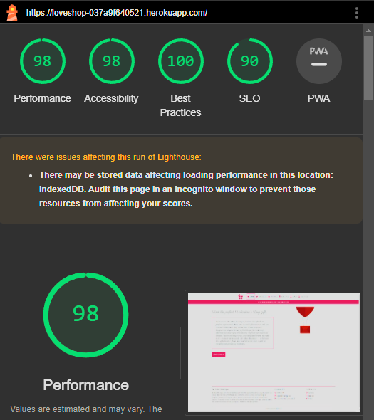

- Mobile (DevTools)

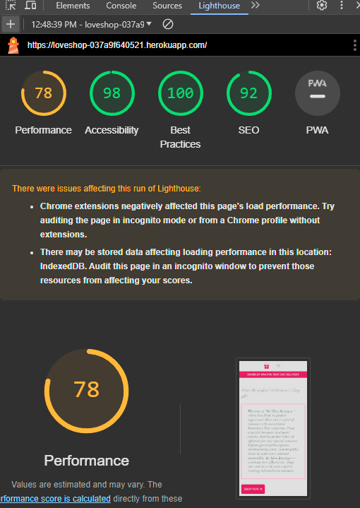

- Wave

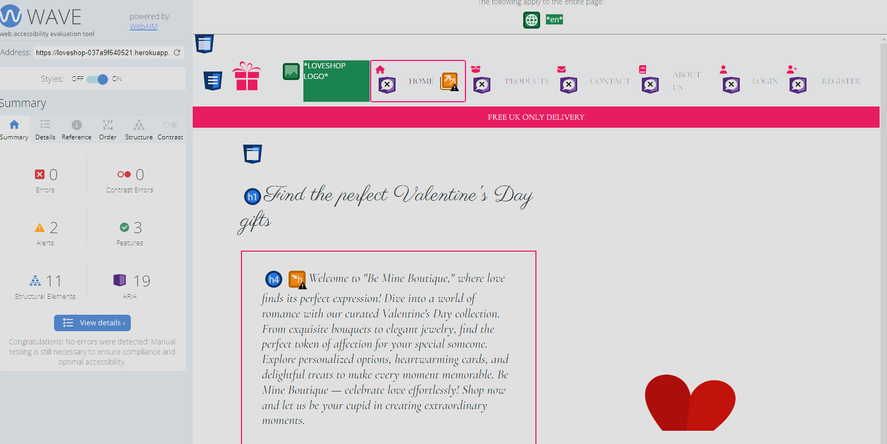

# HTML

- All Pages were checked with the official [W3C validator](https://validator.w3.org/). 

## Home Page

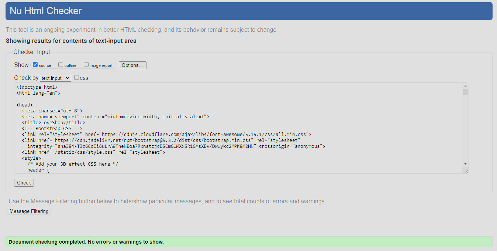

## Products Page

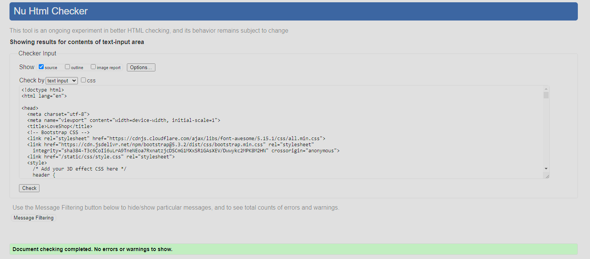

## Products Detail

## Shopping Bag

## Checkout Page

### Order History

## Contact Us Page

- The only error that were given were because of the nature of Django Template Syntax.

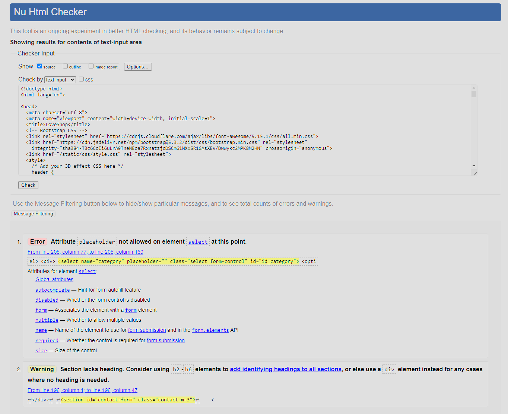

## Contact Us Success Page

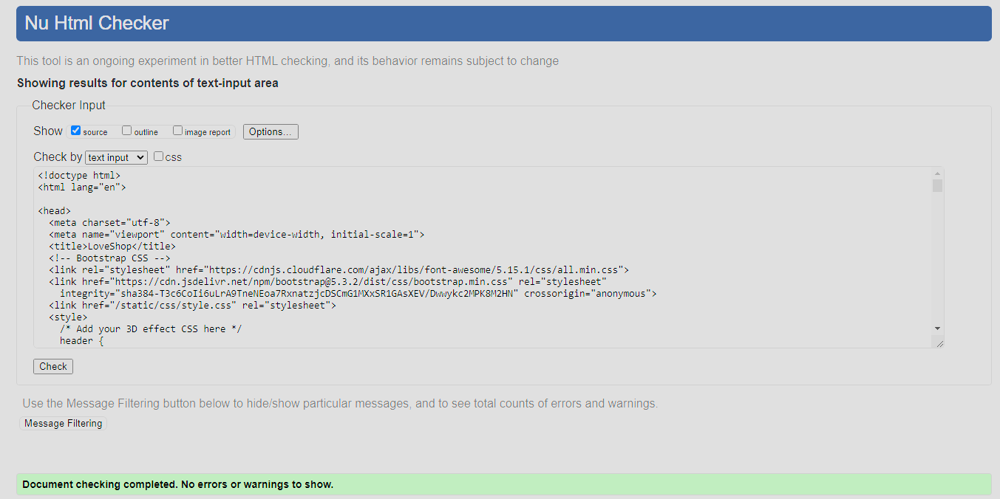

## Login Page

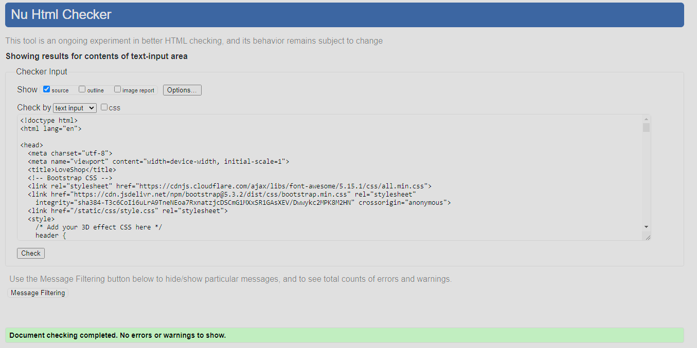

## Registration Page

- The only errors that were given were because of the nature of Django Template Syntax.

# CSS

- All CSS was passed through [W3C CSS Validation](https://jigsaw.w3.org/css-validator/).
- Pass with No Errors

## Style.css

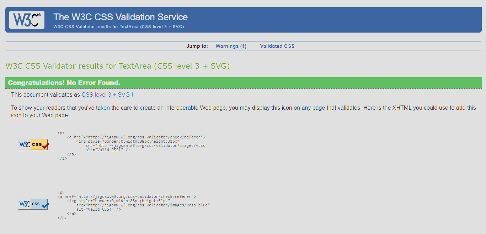

# JSHINT 
- I have used the recommended [JShint Validator](https://jshint.com/) to validate all of my JS files.

## Base

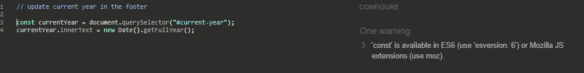

## Checkout 

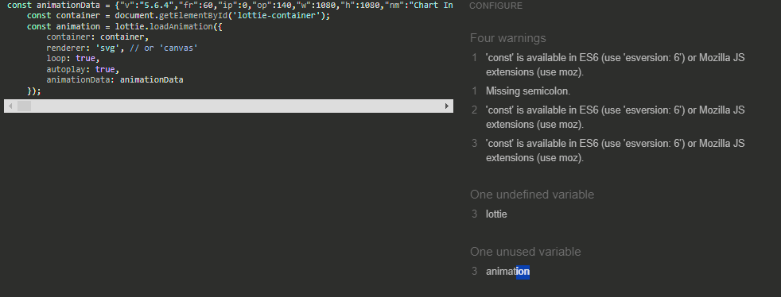

## About

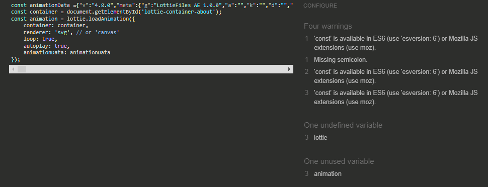

## Payment cancellation

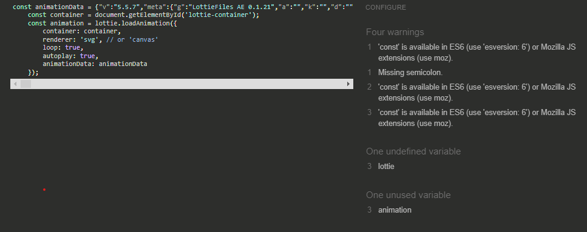

## Payment Successful

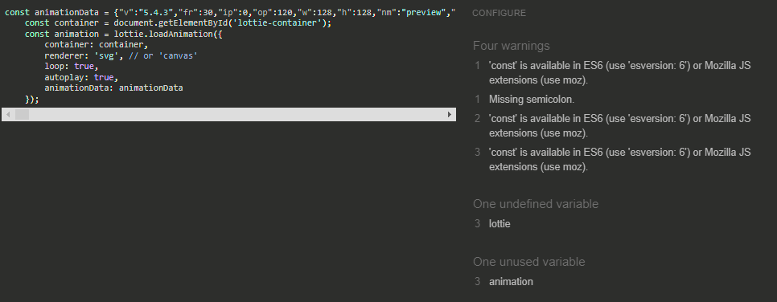

## Review order

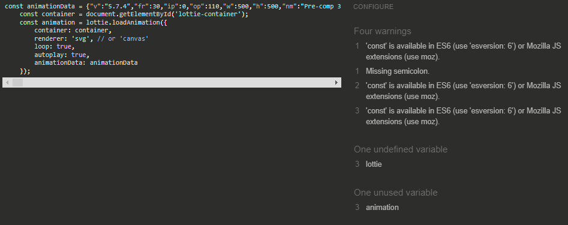

# PEP8
 - PEP8 only shows the type of errors that can be ignored.

 

