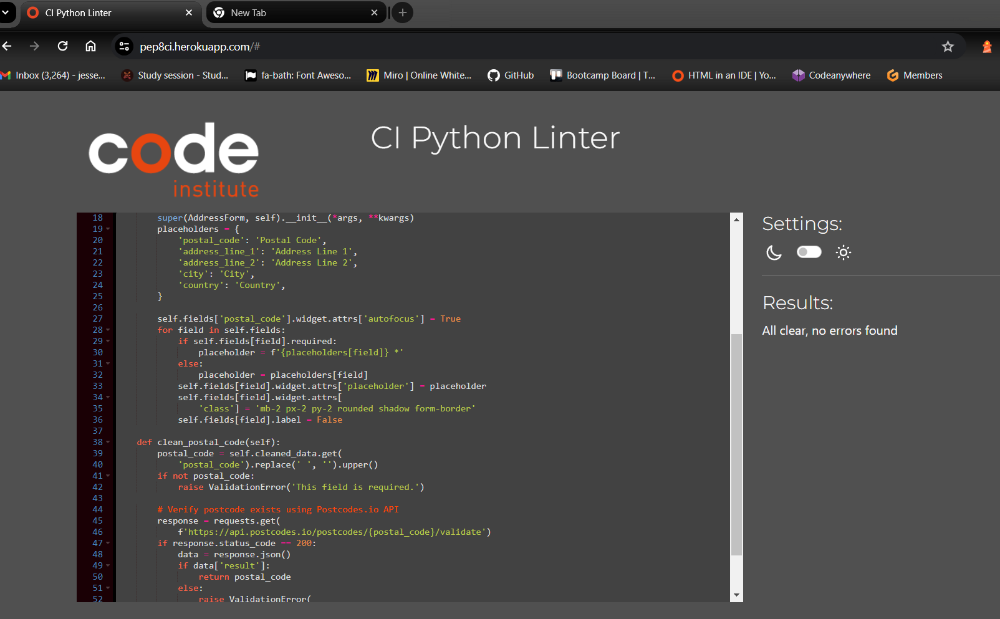
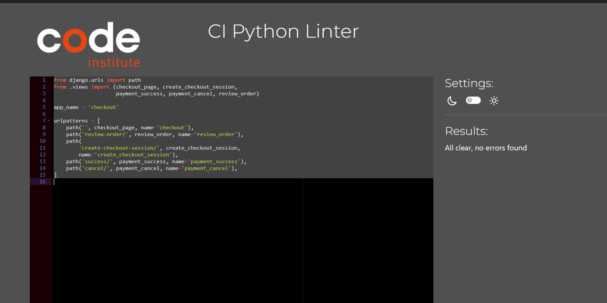
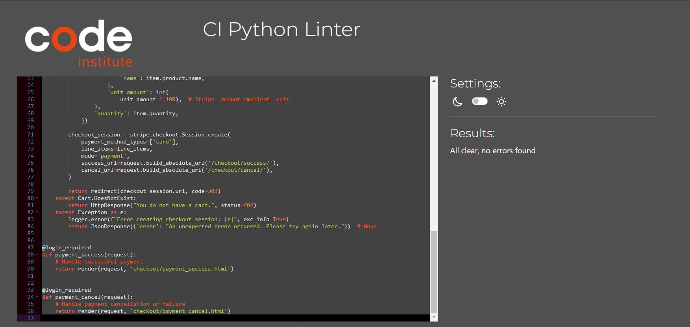
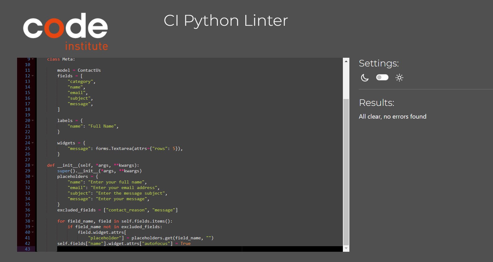
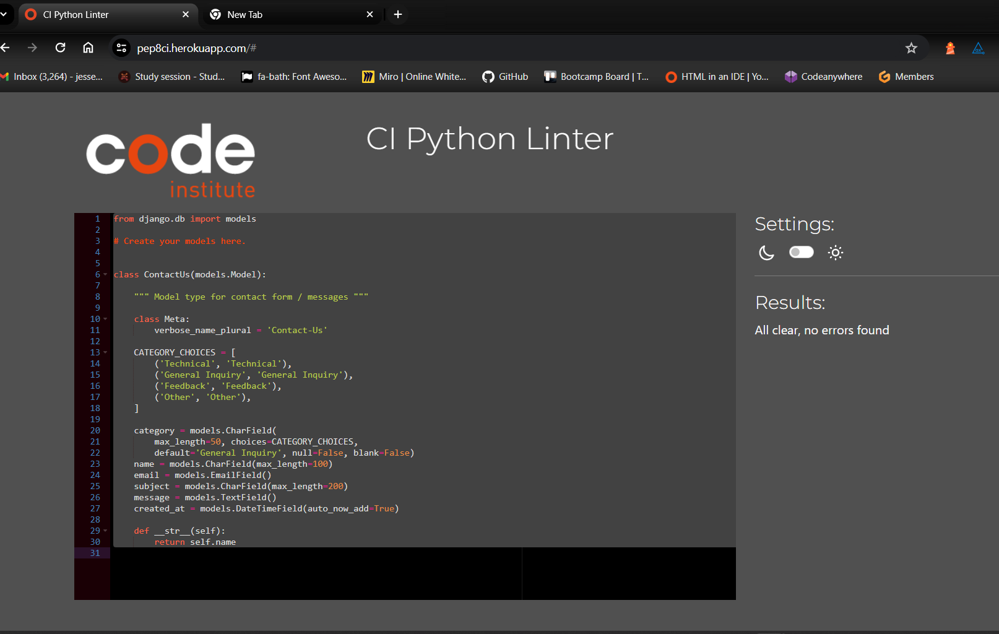
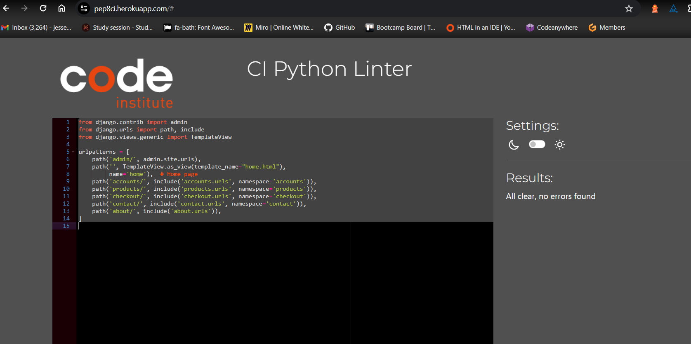
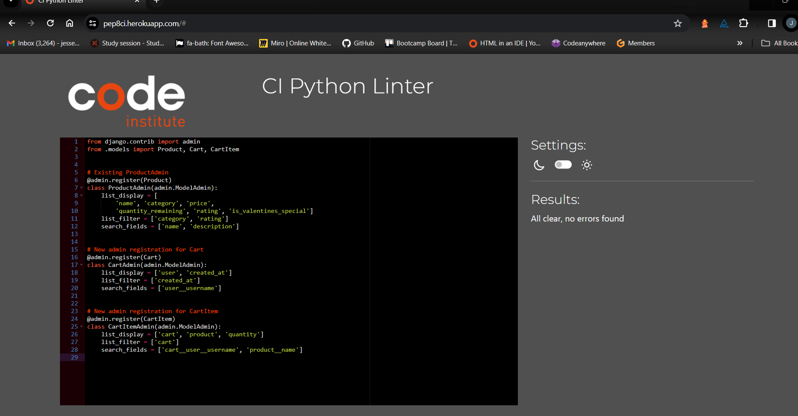

[Validator Testing](#validator-testing)
* [Lighthouse](#lighthouse)
* [HTML](#html)
* [CSS](#css)
* [JSHINT](#jshint)
* [Pylint Validation](#pylint-validation)

Return back to the [README.md](README.md) file.

# Lighthouse 

I've tested deployed project on multiple devices to check for responsiveness issues.
- Desktop

- Mobile (DevTools)

- Wave

# HTML

- All Pages were checked with the official [W3C validator](https://validator.w3.org/). 

## Home Page

## Products Page

## Checkout Page

## Review Order Page

### Payment Cancelled

## Contact Us Page

- The only error that were given were because of the nature of Django Template Syntax.

## Contact Us Success Page

## Login Page

## Registration Page

- The only errors that were given were because of the nature of Django Template Syntax.

# CSS

- All CSS was passed through [W3C CSS Validation](https://jigsaw.w3.org/css-validator/).
- Pass with No Errors

## Style.css

# JSHINT 
- I have used the recommended [JShint Validator](https://jshint.com/) to validate all of my JS files.

## Base

## Checkout 

## About

## Payment cancellation

## Payment Successful

## Review order

# Pylint Validation
### Pylint Validation Remark for Be Mine Boutique Heroku Django Application
After conducting a comprehensive code review and linting process on my Be Mine Boutique Django application, I have identified that the code adheres closely to PEP 8 standards. Here are the detailed observations:

#### Code Structure and Quality
Project Organization: The project directories and files are meticulously organized, promoting ease of navigation and maintenance.

Error Handling: Implementations of try-except blocks, particularly in manage.py and authentication views, are robust and ensure a smooth user experience.
Forms and Data Validation

UserRegisterForm: Custom validation within forms like UserRegisterForm and AddressForm guarantees the integrity and security of user data.

Model Definitions: Models including UserProfile and ContactUs have been crafted with precise field definitions and validators, reinforcing the database's reliability.

#### Views, URLs, and Third-Party Integrations
##### Views and URL Configurations:
 Adherence to Django's conventions in views and URL patterns is evident, showcasing clean and maintainable code.

##### Stripe Integration:
 The Stripe payment integration is executed with meticulous detail, ensuring transaction security and effectiveness.

##### Line Length Considerations

Line Length Exceptions: There are several instances where line lengths exceed the PEP 8 recommended limit of 79 characters. These are edge cases involving long strings and complex constructs where breaking lines would compromise code clarity.

##### Static Assets
Static Images: The static resources, specifically Pylint output images, are appropriately placed within the ./workspace/loveshop/images/pylint/ directory, following Django's conventions for static files.

##### In summary, the review has led to the conclusion that the Be Mine Boutique application's codebase is of exceptional quality. The few instances where lines exceed the recommended length are justified due to the nature of the elements involved, such as URLs and long string literals, where splitting the lines would not be practical.

